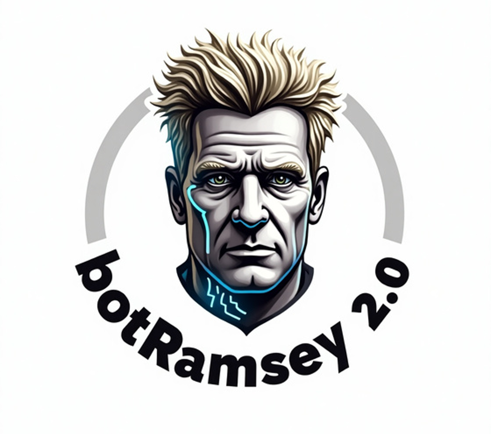

# BotRamsey-2.0

**Tu Asistente Culinario Inteligente**

## Tabla de Contenidos

1. [Descripción](#descripción)
2. [Arquitectura](#arquitectura)
3. [Proceso de Desarrollo](#proceso-de-desarrollo)
4. [Funcionalidades](#funcionalidades)
5. [Estado del Proyecto](#estado-del-proyecto)

## Descripción

**BotRamsey-2.0** es un chatbot de recetas desarrollado con Django y React.
Su objetivo es ayudar a los usuarios en la cocina proporcionando recetas detalladas, explicaciones paso a paso, recomendaciones personalizadas y funcionalidades avanzadas como búsqueda por voz y cronómetros automáticos.

### Características principales:
- Recomendación de recetas basada en el historial de búsqueda del usuario.
- Procesamiento de lenguaje natural (PLN) con **BERT** para interpretar consultas.
- Uso de **TF-IDF y Cosine Similarity** para mejorar las recomendaciones.
- **Búsqueda por voz** integrada.
- **Explicación paso a paso** para facilitar la preparación de las recetas.
- **Cronómetro automático** ajustado según el tiempo de cada paso de la receta.

## Arquitectura

El proyecto sigue una arquitectura basada en **cliente-servidor** con las siguientes tecnologías:

- **Frontend:** React.js
- **Backend:** Django (Django REST Framework)
- **Modelos de Machine Learning:**
  - **Recomendaciones:** TF-IDF + Cosine Similarity
  - **Procesamiento de Lenguaje Natural:** Modelo BERT

### precision del modelo

## Proceso de Desarrollo

1. **Fuente del Dataset:**
   - Recopilación de recetas desde fuentes abiertas y curación de datos.

2. **Limpieza de Datos:**
   - Normalización de ingredientes y pasos.
   - Eliminación de datos duplicados.
   - Conversión de unidades.

3. **Manejo de Excepciones y Control de Errores:**
   - Validación de inputs del usuario.
   - Manejo de errores en las búsquedas y recomendación de alternativas.

4. **Análisis Estadístico:**
   - Distribución de categorías de recetas.
   - Popularidad de ingredientes y tiempos de preparación.

## Funcionalidades Extra

### 1. Integración Web
- **Tecnología/Herramientas usadas:** React.js, Django.
- **Arquitectura:** Cliente-Servidor con API REST.

### 3. Desarrollo de Interfaz Gráfica de Usuario
- **Tecnología/Herramientas usadas:** React.js.
- **Arquitectura:** SPA (Single Page Application) con React y API REST.

## Estado del Proyecto

- [x] Desarrollo del chatbot.
- [x] Implementación de recomendación de recetas.
- [x] Integración con búsqueda por voz.
- [x] Creación del cronómetro inteligente.
- [x] Optimización de la interfaz de usuario.

